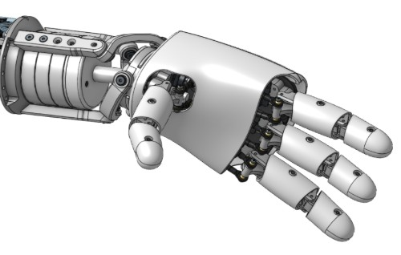
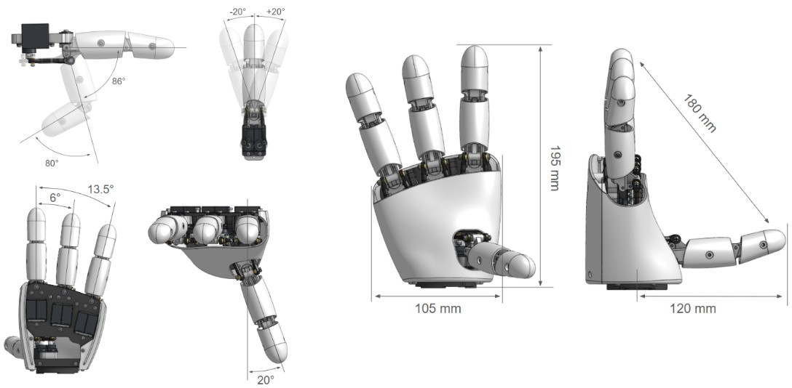
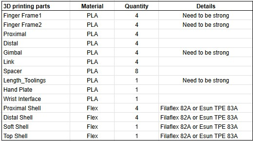

Project is licensed under [Apache 2.0](https://www.apache.org/licenses/LICENSE-2.0)

Mechanical design is licensed under a :
[Creative Commons Attribution 4.0 International License][cc-by].
[![CC BY 4.0][cc-by-image]][cc-by]
[![CC BY 4.0][cc-by-shield]][cc-by]

[cc-by]: http://creativecommons.org/licenses/by/4.0/
[cc-by-image]: https://licensebuttons.net/l/by/4.0/88x31.png
[cc-by-shield]: https://img.shields.io/badge/License-CC%20BY-lightgrey.svg

# Amazing Hand project

Robotic hands are often very expensive and not so expressive. More dexterous often needs cables and deported actuators in forearm i.e..

Aim of this project is to be able to explore humanoid hand possibilities on a real robot (and Reachy2 is the perfect candidate for that !) with moderate cost.
=> Wrist interface is designed for Reachy2's wrist (Orbita 3D), but it can be easily adapted to other robot's wrist...

Amazing Hand is :
- 8 dofs humanoid hand with 4 fingers
- 2 phalanxes per finger articulated together
- flexible shells allmost everywhere
- All actuators inside the hand, without any cables
- 3D printable
- 400g weight
- low-cost (<200€)
- open-source

[AmazingHand_Overview](/docs/AmazingHand_Overview.pdf)

Each finger is driven by parallel mechanism. 
That means 2x small Feetech SCS0009 servos are used to move each finger in flexion / extension & Abduction / Adduction

2 ways of control are available :
- Use a Serial bus driver (waveshare i.e.) + Python script
- Use an Arduino + feetech TTL Linker

Detailed explaination are available for both ways and Basic demo software is available also.
Up to you !

## Table of contents

- [Build Resources](#build-resources)
    - [BOM (Bill Of Materials)](#bom-bill-of-materials)
    - [CAD Files and Onshape document](#CAD-files-and-onshape-document)
    - [Assembly Guide](#assembly-guide)
    - [Run_basic_Demo](#Run-basic-Demo)
- [Disclaimer](#disclaimer)
- [AmazingHand_tracking Demo](#AmazingHand_tracking_Demo) 
- [Project Updates & Community](#project-updates--community)
    - [Updates history](#updates-history)
    - [Project posts](#project-posts)
    - [To Do List](#to-do-list)
    - [FAQ](#faq)
    - [Contact](#contact)
    - [Thank you](#thank-you)

# Build Resources
## BOM (Bill Of Materials)
List of all needed components is available here:  
[AmazingHand BOM](https://docs.google.com/spreadsheets/d/1QH2ePseqXjAhkWdS9oBYAcHPrxaxkSRCgM_kOK0m52E/edit?gid=1269903342#gid=1269903342)  

And remember to add control choice cost (2 options detailed previously)

Detailed for custom 3D printed parts are here : 
[3Dprinted parts](https://docs.google.com/spreadsheets/d/1QH2ePseqXjAhkWdS9oBYAcHPrxaxkSRCgM_kOK0m52E/edit?gid=2050623549#gid=2050623549)

Here is guide to explain how to print all the needed custom parts :
[=> 3D Printing Guide](/docs/AmazingHand_3DprintingTips.pdf)
 

## CAD Files and Onshape document
STL and Steps files can be found [here](https://github.com/pollen-robotics/AmazingHand/tree/main/cad) 

Note that Fingers are the same if you want to build a left hand, but some parts are symetrical. Specific right hand parts are preceded by an "R", and other of the left hand parts by an "L".

Everyone can access the Onshape document too:   
[Link Onshape](https://cad.onshape.com/documents/430ff184cf3dd9557aaff2be/w/e3658b7152c139971d22c688/e/bd399bf1860732c6c6a2ee45?renderMode=0&uiState=6867fd3ef773466d059edf0c)  

Note that predefined position are available in "named position" tooling, with corresponding servos angles

  

## Assembly Guide

Assembly guide for the Amazing Hand in combination with standards components in the BOM is here :  
[=> Assembly Guide](/docs/AmazingHand_Assembly.pdf)  
  

You will need simple program / script to calibrate each fingers, available here :
- With Python & Waveshare serial bus driver : [here](https://github.com/pollen-robotics/AmazingHand/tree/main/PythonExample)
- With Arduino & TTLinker : [here](https://github.com/pollen-robotics/AmazingHand/tree/main/ArduinoExample)

Note that this assembly guide is for a standalone Right hand.

If you need to build a standalone Left hand, you can keep the sames IDs for servos location, and select if it's a right or left hand in the software.

BUT, if you need to build both right and left hands to plug them on a robot, you will have to attribute differents IDs for right and left hands. You can't have same ID for different servos on the same serial bus...

## Run basic Demo

Basic Demo which is available with both Python & Arduino.

You will need external power supply to be able to power the 8 actuators inside the hand.

If you don't have one already, simple external power supply could be a DC/DC 220V -> 5V / 2A adapter with jack connector.
Check on the Bom List :
[AmazingHand BOM](https://docs.google.com/spreadsheets/d/1QH2ePseqXjAhkWdS9oBYAcHPrxaxkSRCgM_kOK0m52E/edit?gid=1269903342#gid=1269903342) 

- Python script : "AmazingHand_Demo.py" [here](https://github.com/pollen-robotics/AmazingHand/tree/main/ArduinoExample)
  
- Arduino program : "AmazingHand_Demo.ino" [here](https://github.com/pollen-robotics/AmazingHand/tree/main/PythonExample)

https://github.com/user-attachments/assets/485fc1f4-cc57-4e59-90b5-e84518b9fed0

# Disclaimer

I noticed some variations between theorical angles for Flexion / Extension, Abduction / Adduction and angles in real life prototypes. This is probably due to several sources of variation (3D printed parts are not perfect, balljoint rods are manually adjusted one by one, esrvo horn rework, flexibility of plastic parts...).

This design has not yet bene tested for long and complex prehensive tasks. Before to be able to grasp objetcs safely (that means without damaging servos or mehanical parts), kind of smart software need to be build.
SCS0009 servos have smart capaibilities as:
- Torque enable / disable
- Torque feedback
- Current position sensor
- Heat temperature feedback
- ...

# AmazingHand advanced Demo

For more advanced usage using inverse/forward kinematics there are several examples in the [Demo](Demo) directory along with some useful tools to test/configure the motors.

# Project Updates & Community
## Updates history
[Updates history](/docs/changelog.md)  

## To Do List
- Design small custom pcb with serial hub and power supply functions, to fit everything in the hand
- Test with prehensive tasks 
      => Add smarter behaviour for closing hand, based on avalable motors feedbacks
- Study possibility to have 4 different fingers length, or add a 5th finger
- Study possibility to use STS3032 feetedch motors instead of SCS0009
      => Stronger for quite the same volume, but servo horn is different
- Study possibility to add compliancy by replacing rigid links to springs
- Add fingertip sensor to push one step higher smart control

## FAQ
WIP

## Contact
[Contact me or Pollen Robotics](/docs/contact.md)

## Thank you
Huge thanks to those who have contributed to this project so far:
- [Steve N'Guyen](https://github.com/SteveNguyen) for beta testing, Feetech motors integration in Rustypot, Mujoco/Mink and hand tracking demo
- [Pierre Rouanet](https://github.com/pierre-rouanet) for Feetech motors integration in pypot  
- [Augustin Crampette](https://fr.linkedin.com/in/augustin-crampette) & [Matthieu Lapeyre](https://www.linkedin.com/in/matthieulapeyre/) for open discussions and mechanical advices
